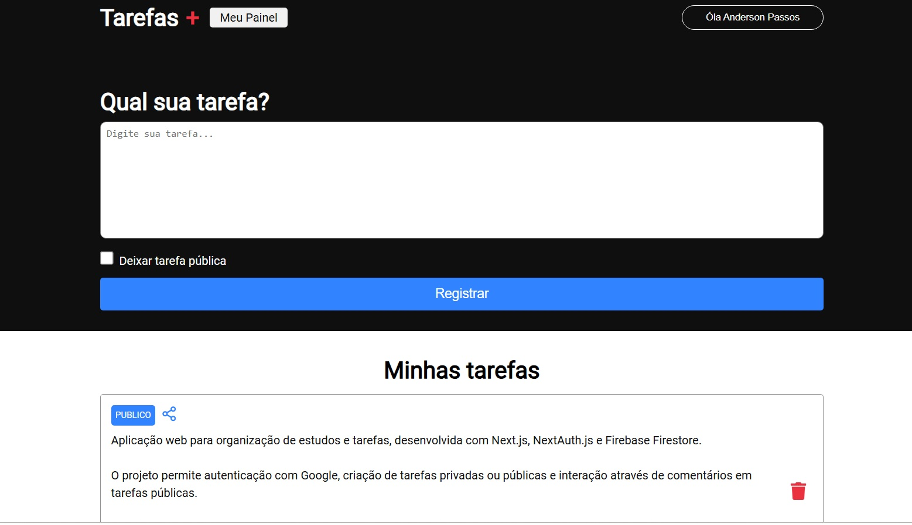

# Task Manager – Next.js + NextAuth + Firebase

Aplicação web para organização de estudos e tarefas com autenticação via Google.

O projeto permite criar tarefas privadas ou públicas e comentar em tarefas públicas, com persistência de dados no Firebase Firestore.

## 🚀Tecnologias

Next.js (Pages Router)

TypeScript

NextAuth.js (OAuth Google)

Firebase Firestore

CSS Modules

## 📌 Funcionalidades

Login com Google

Criação de tarefas

Persistência no Firestore

Tarefas públicas com sistema de comentários

Renderização dinâmica após atualização dos dados

## 🧠 Conceitos Aplicados

Integração OAuth com NextAuth

Uso de variáveis de ambiente

Conexão com banco NoSQL

Estruturação de coleções no Firestore

Organização de projeto com separação de responsabilidades

## 🎯 Objetivo

Projeto desenvolvido para praticar autenticação, persistência de dados e estruturação de aplicações com Next.js.